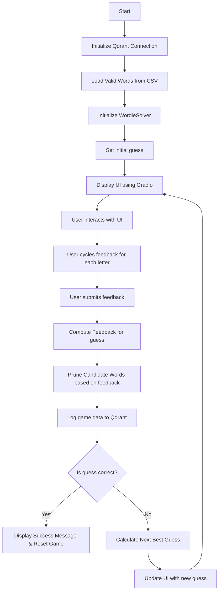
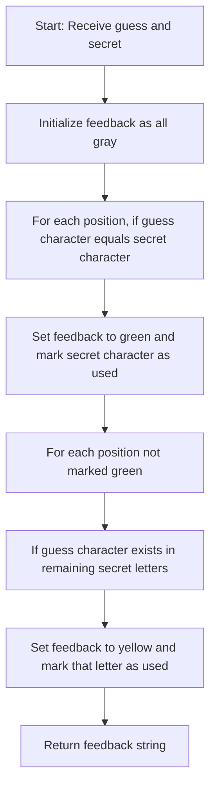

# Advanced Wordle Solver

## Overview

The **Advanced Wordle Solver** is a Python-based project that efficiently solves Wordle puzzles in the fewest number of guesses possible. It leverages a combination of frequency-based heuristics, historical game data logging, and interactive visualizations to optimize the guessing strategy. The solver starts with a fixed word ("crate") and refines its approach based on user feedback, making each subsequent guess more informed.

## Features

- **Optimal Guess Strategy:**  
  Uses candidate letter frequency and a historical bonus (sourced from logged game data) to determine the next best guess. The algorithm prunes the list of possible words based on feedback and selects the guess with the highest computed score.

- **Interactive User Interface:**  
  Built with [Gradio](https://gradio.app/), the UI offers a Wordle-like experience:
  - A large display showing the current guess with color-coded feedback.
  - Small buttons under each letter that allow users to cycle through feedback states (gray, yellow, green).
  - Easy-to-use controls for submitting feedback and restarting the game.

- **Dynamic Data Visualization:**  
  Two types of interactive visualizations are provided:
  - A **heatmap** showing letter frequency across different positions.
  - A **confidence chart** that displays the likelihood of each letter being correct in its respective position.

- **Qdrant Integration for Logging:**  
  Game data (guesses, feedback, and candidate counts) is logged into a Qdrant database. This historical data is later retrieved to add a bonus to candidate scoring, thereby refining the solver’s performance over time.

- **Efficient Feedback Calculation:**  
  The project utilizes LRU caching to optimize the computation of feedback, ensuring that the solver remains fast even when processing multiple guesses.

## Live Demo

The project is also hosted on [Hugging Face Spaces](https://huggingface.co/spaces/Lazer24/WordleBot). You can try out the interactive Wordle Solver directly in your web browser without any local setup.

## How It Works

1. **Loading Valid Words:**  
   The solver reads from a CSV file (`wordle.csv`) that contains valid 5-letter words. It filters out any words that do not meet the criteria and builds a unique set of candidate words.

2. **Feedback Mechanism:**  
   A dedicated function compares the current guess against the secret word to generate feedback:
   - `g` (green): Correct letter in the correct position.
   - `y` (yellow): Correct letter in the wrong position.
   - `b` (gray): Incorrect letter.

3. **Candidate Pruning:**  
   Based on the feedback, the solver filters out candidates that wouldn’t produce the same feedback, ensuring only plausible words remain.

4. **Advanced Guess Selection:**  
   For subsequent attempts, the solver calculates a score for each candidate using:
   - **Frequency Analysis:** How common letters are among remaining candidates.
   - **Historical Bonus:** Additional weight is given to candidates with letters that have performed well in previous games (data fetched from Qdrant).

5. **Interactive User Interface:**  
   The UI mimics the classic Wordle game layout:
   - The current guess is displayed using styled letter boxes.
   - Users cycle through letter states using buttons.
   - Visualizations update in real time to show the effect of pruning the candidate list.

6. **Historical Data Logging:**  
   Each guess and its feedback are logged to Qdrant with a dummy vector. This logged data is then used to compute historical statistics, which in turn influence the guess scoring in future attempts.

## Setup and Installation

### Prerequisites

- **Python 3.6+**
- **Qdrant API Key:** Set your API key in the environment variable `qdrant_api_key`.

### Installation Steps

1. **Clone the Repository:**
   ```bash
   git clone https://github.com/yourusername/advanced-wordle-solver.git
   cd advanced-wordle-solver

2. **Install Dependencies::**
   ```bash
   pip install -r requirements.txt

3. **Set Up Qdrant API Key: Ensure you have your Qdrant API key available:**
   ```bash
   export qdrant_api_key=YOUR_API_KEY

4. **Run the Application:**
   ```bash
   python app.py

## Project Structure

**app.py:**  
Contains the core logic for the Wordle solver, including:
- Game logic and feedback computation.
- Advanced guess strategy and candidate pruning.
- Qdrant integration for logging and historical stats.
- Gradio UI components and data visualizations.

**requirements.txt:**  
Lists the Python packages required to run the project:
- gradio
- pandas
- plotly
- qdrant-client

**wordle.csv:**  
A CSV file with a column named `word` containing valid 5-letter words used by the solver.

## Usage

**Start a New Game:**  
Launch the application locally or visit the [Hugging Face Spaces demo](https://huggingface.co/spaces/Lazer24/WordleBot) to start the game. The UI will automatically display the initial guess.

**Submit Feedback:**  
Cycle the feedback (gray → yellow → green) for each letter using the buttons below the guess. Once satisfied, click **Submit Feedback** to update the solver’s state.

**View Visualizations:**  
The letter frequency heatmap and confidence chart update based on the remaining candidate words, providing insights into the solver’s decision-making process.

**Restart Game:**  
Click the **Start New Game** button to reset the solver and begin again.

## Future Enhancements

**Enhanced Vector Usage:**  
Currently, a dummy vector is used for Qdrant logging. Future iterations may incorporate meaningful vector representations for deeper analysis.

**Refined Heuristics:**  
Further improvements could involve integrating additional machine learning techniques to improve the guessing strategy even further.

**Extended Analytics:**  
More in-depth visualizations and analytics can be added based on accumulated game data to offer richer insights.

## Flowcharts

### Overall Application Flow



### Feedback Computation Process


## License

This project is licensed under the [MIT License](LICENSE).

